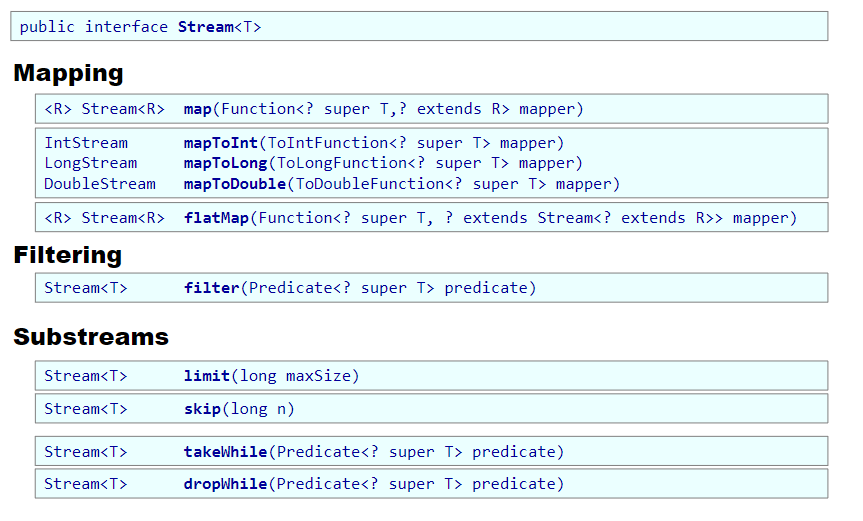
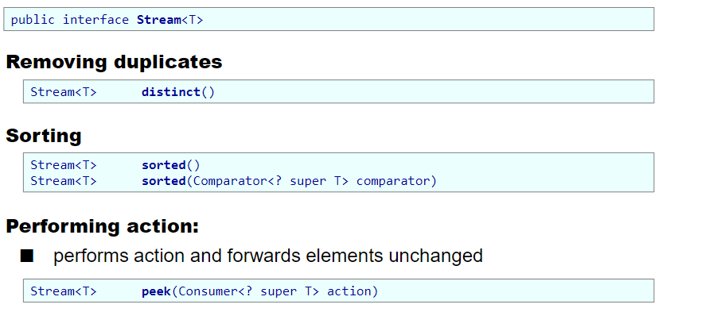

# Lazy Evaluation and Streams

## Was ist strict evaluation?
-> call-by-value
- Ausdrücke werden direkt berechnet, bevor sie tatsächlich benötigt werden.
- jede Berechnung wird einmal durchgeführt und das Ergebnis gespeichert.
- effizient wenn man den Wert sicher benötigt.

```scala
lazy val x = {
  println("Berechnung von x")
  42
}

println("Vor der Nutzung von x")
println(x) // Erst hier wird x berechnet
println(x) // x wurde bereits berechnet und wird nur ausgegeben

Vor der Nutzung von x
Berechnung von x
42
42
```

## Was ist non-strict evaluation?
-> call-by-name
- Ausdrücke werden erst berechnet, wenn sie tatsächlich benötigt werden.
- jede Berechnung wird bei jedem Zugriff durchgeführt, Wert wird nicht gespeichert.
- nicht das selbe wie lazy evaluation, da lazy evaluation den Wert speichert und nur einmal berechnet.
```
def callByName(x: => Int): Int = {
  println("Funktion aufgerufen")
  x + x
}

val result = callByName({
  println("Berechnung von x")
  42
})

println("Vor der Nutzung von x")
println(result) // result wird hier berechnet
println(result) // result wird hier erneut berechnet

Funktion aufgerufen
Berechnung von x
42
Berechnung von x
42
```

## Was ist lazy evaluation?
- Ausdrücke werden erst berechnet, wenn sie tatsächlich benötigt werden.
- Wert wird gespeichert und nur einmal berechnet.

```scala
lazy val x = {
  println("Berechnung von x")
  42
}

println("Vor der Nutzung von x")
println(x) // Erst hier wird x berechnet
println(x) // x wurde bereits berechnet und wird nur ausgegeben


Vor der Nutzung von x
Berechnung von x
42
42
```

## Vergleiche val, lazy val und def (function).


## Was ist ein Stream in Scala und wie unterscheidet er sich von einer normalen Liste?
- Ein Stream ist eine Datenstruktur, die Elemente nur bei Bedarf berechnet (lazy evaluation).	

## Wie funktioniert Lazy Evaluation in Streams?

```scala
val stream: Stream[Int] = Stream(1, 2, 3, 4, 5)
println(stream.head)  // 1 (wird sofort berechnet)
println(stream.tail)  // Stream(2, ?) (Tail wird erst jetzt berechnet)
```

Unterschied zu Liste:
Listen:
- strict evaluation
- speichert alle Elemente im Speicher
- sofortige Berechnung aller Elemente
- gut für fixierte Datenmengen, wobei Streams besser für unendliche oder große Datenmengen 

## Was ist der Unterschied zwischen externer und interner Iteration?
externe Iteration passiert bei Verwendung einer Collection im User Code:
```scala
List<String> highPriceNames = new ArrayList<>();
for (Article a : articles) {
    if (a.getPrice() > 100) {
        highPriceNames.add(a.name);
    }
}
```

interne Iteration wird von Stream bereitgestellt:
```scala
List<String> highPriceNames = articles.stream()
    .filter(a -> a.price > 100)
    .map(a -> a.name)
    .collect(Collectors.toList());
```

## Was ist eager und lazy processing?
Eager Processing:
- alle Operationen werden sofort ausgeführt

```scala
val numbers = List(1, 2, 3, 4, 5, 6, 7, 8, 9, 10)

val eagerResult = numbers
  .map(i => i * i) // Alle Zahlen werden quadriert
  .filter(sq => sq % 2 != 0) // Dann werden nur ungerade Quadratzahlen behalten
  .take(2) // Dann werden die ersten 2 genommen

println(eagerResult) // List(1, 9)
```
-> führt dazu, dass alle Elemente berechnet werden, auch wenn am Ende nur 2 benötigt werden.

Lazy Processing:
- Operationen werden erst ausgeführt, wenn sie benötigt werden

```scala
val numbersStream = LazyList.from(1) // Unendlicher Stream von Zahlen

val lazyResult = numbersStream
  .map(i => i * i) // Wird erst berechnet, wenn gebraucht
  .filter(sq => sq % 2 != 0) // Wird erst angewendet, wenn vorherige Werte bekannt sind
  .take(2) // Erst jetzt werden genau 2 Werte berechnet

println(lazyResult.toList) // List(1, 9)
```
-> führt dazu, dass nur die benötigten Werte berechnet werden, was Speicher und Rechenzeit spart.

## Welche Möglichkeiten gibt es einen Stream zu erstellen?
| Methode                     | Typ        | Beschreibung                                         | Beispiel                                        |
|-----------------------------|-----------|-----------------------------------------------------|------------------------------------------------|
| **Stream.of**               | Endlich   | Erstellt einen Stream aus einzelnen Werten         | `Stream.of("Ann", "Pat", "Mary", "Joe")`       |
| **Stream.concat**           | Endlich   | Verbindet zwei Streams                             | `Stream.concat(single, names)`                 |
| **Stream.empty**            | Endlich   | Erstellt einen leeren Stream                       | `Stream.empty()`                                |
| **Collection.stream**       | Endlich   | Erstellt einen Stream aus einer Collection         | `words.stream()`                                |
| **Arrays.stream**           | Endlich   | Erstellt einen Stream aus einem Array              | `Arrays.stream(words)`                          |
| **IntStream.range**         | Endlich   | Erstellt einen Stream von Ganzzahlen (exklusiv)    | `IntStream.range(0, 100)`                       |
| **Files.lines**             | Endlich   | Stream von Zeilen einer Datei                      | `Files.lines(Paths.get("data.txt"))`            |
| **BufferedReader.lines**    | Endlich   | Stream von Zeilen aus einem `BufferedReader`       | `reader.lines()`                                |
| **String.chars**            | Endlich   | IntStream von Zeichen eines Strings               | `"This is a text".chars()`                      |
| **Stream.generate**         | Unendlich | Erzeugt Werte durch eine Supplier-Funktion        | `Stream.generate(() -> Random.nextInt(100))`   |
| **Stream.iterate**          | Unendlich | Erzeugt Werte durch wiederholte Anwendung         | `Stream.iterate(1, _ * 2)`                      |
| **Random.ints**             | Unendlich | Zufallswerte als IntStream                         | `rand.ints(0, 10)`                      |
| **SplittableRandom.ints**   | Unendlich | Parallele Zufallswerte als IntStream              | `splitableRandom.ints(0, 10)`                   |

## Welche Intermediate Operationen gibt es?




## Was macht `map` und`flatMap`?
- `map` wird verwendet, um jeden Wert eines Streams zu transformieren.
- `flatMap` wird verwendet, um einen Stream von Streams in einen einzelnen Stream zu transformieren.

## Was machen Terminal Operationen und was sind Beispiele dafür?
= Operationen, die den Stream tatsächlich verarbeiten und ein Ergebnis zurückgeben. (eager)

Iteration:
- `forEach` - führt eine Aktion für jedes Element aus
- `forEachOrdered` - führt eine Aktion für jedes Element in der Reihenfolge aus, in der sie im Stream erscheinen

Find:
- `findFirst` - gibt das erste Element des Streams zurück
- `findAny` - gibt ein beliebiges Element des Streams zurück

Reduction:
- `reduce` - reduziert den Stream auf einen einzelnen Wert
- `count` - zählt die Anzahl der Elemente im Stream

Collect:
- `collect` - sammelt die Elemente des Streams in eine Collection

```scala
List<Integer> numbers = Arrays.asList(1, 2, 3, 4, 5);

// Iteration: forEach
numbers.stream().forEach(n -> System.out.print(n + " ")); // Ausgabe: 1 2 3 4 5 
System.out.println();

// Iteration: forEachOrdered (bei parallelen Streams sinnvoll)
numbers.parallelStream().forEachOrdered(n -> System.out.print(n + " ")); // Ausgabe: 1 2 3 4 5
System.out.println();

// Find: findFirst
Optional<Integer> first = numbers.stream().findFirst();
System.out.println("FindFirst: " + first.orElse(-1)); // Ausgabe: FindFirst: 1

// Find: findAny
Optional<Integer> any = numbers.stream().findAny();
System.out.println("FindAny: " + any.orElse(-1)); // Ausgabe: FindAny: 1 (oder anderes Element, je nach Implementierung)

// Reduction: reduce (Summe aller Zahlen)
int sum = numbers.stream().reduce(0, Integer::sum);
System.out.println("Summe: " + sum); // Ausgabe: Summe: 15

// Reduction: count (Anzahl der Elemente)
long count = numbers.stream().count();
System.out.println("Anzahl der Elemente: " + count); // Ausgabe: Anzahl der Elemente: 5

// Collect: collect (Sammeln in eine Liste)
List<Integer> squaredNumbers = numbers.stream()
                                        .map(n -> n * n)
                                        .collect(Collectors.toList());
System.out.println("Quadratzahlen: " + squaredNumbers); // Ausgabe: Quadratzahlen: [1, 4, 9, 16, 25]
```

## Was ist der Unterschied zwischen Stateful und Stateless Operationen?
- Stateless Operationen benötigen keinen Zustand des Streams, um ihre Berechnungen durchzuführen. (z.B. `map`, `filter`, `flatMap`)
```scala
List<Integer> numbers = Arrays.asList(1, 2, 3, 4, 5);
List<Integer> doubled = numbers.stream()
                               .map(n -> n * 2) // Jedes Element unabhängig transformiert
                               .collect(Collectors.toList());
System.out.println(doubled); // [2, 4, 6, 8, 10]
```

- Stateful Operationen benötigen den Zustand des Streams, um ihre Berechnungen durchzuführen. (z.B. `distinct`, `sorted`, `limit`)
```scala
List<Integer> numbers = Arrays.asList(3, 1, 4, 1, 5, 9, 2);
List<Integer> sortedNumbers = numbers.stream()
                                     .sorted() // Muss den gesamten Stream kennen
                                     .collect(Collectors.toList());
System.out.println(sortedNumbers); // [1, 1, 2, 3, 4, 5, 9]
```