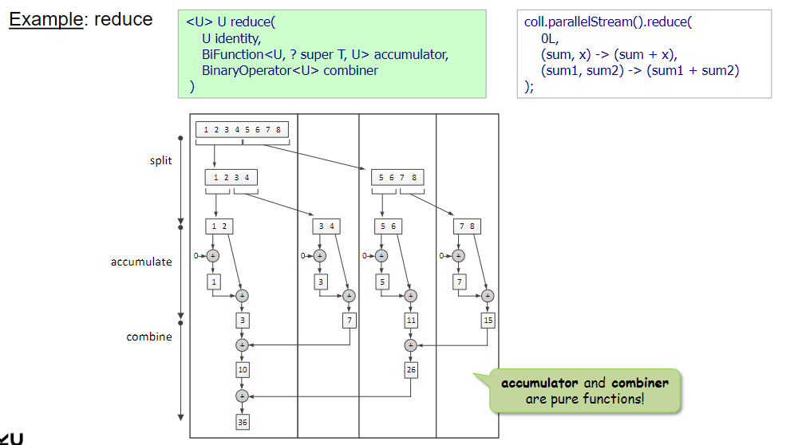

# Parallel Streams

## Wie kann man zwischen parallelen und sequentiellen Streams switchen?
Zu Parallel:
- `parallelStream()` - parallel Stream von einer Collection
```scala
Collection<Long> col = new ArrayList<Long>();
for (int i = 0; i < 1000000; i++) {
    col.add((long) i);
}
col.parallelStream().reduce(0L, Long::sum); // 0L ist der Startwert, falls der Stream leer ist wird 0L zurückgegeben
```
- `parallel()` - parallel Stream von einem Stream
```scala
Long[] array = new Long[1000000];
for (int i = 0; i < 1000000; i++) {
    array[i] = (long) i;
}
Arrays.stream(array).parallel().reduce(0L, Long::sum); 
```

Zu Sequentiell:
- `sequential()` 
```scala
coll.parallelStream().map(x -> x * x).sequential().sorted().reduce(0L, Long::sum);
```

## Wie funktioniert Parallel Processing?
Der Stream wird in mehrere Teile aufgeteilt, die dann parallel verarbeitet werden.
Die Ergebnisse der einzelnen Teile werden dann zusammengeführt. Dies geschieht in mehreren Phasen:
- Splitting: Stream wird in mehrere Teile aufgeteilt
- Accumulation: Sequenzielle Verarbeitung der Teile
- Combine: Ergebnisse der Teile werden zusammengeführt



## Was ist ein Spliterator?
= Interface für parallele Ausführung von Streams
- Split = Aufteilen des Streams in mehrere Teile
- Iterator = Durchlaufen der Teile