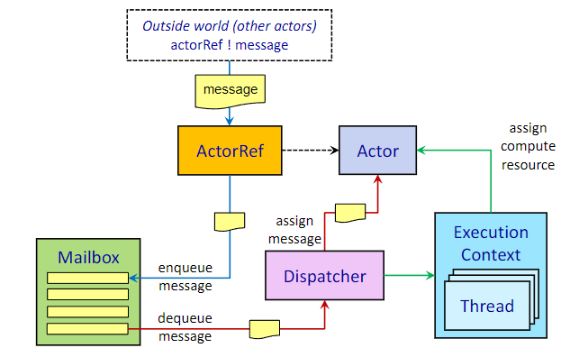

# Actor Fundamentals

## Was ist ein Actor?
Ein Actor ist ein Objekt, das Nachrichten empfangen und darauf reagieren kann. Es ist eine grundlegende Einheit der Berechnung in einem Actor-System. Jeder Actor hat einen eigenen Zustand und kann andere Actors erstellen, Nachrichten senden und empfangen. Actors sind unabhängig und kommunizieren asynchron über Nachrichten.

Beispiel:
```scala
object Calculator:
    case class Add(value: Int)
    case object Get
```

```scala
class CalculatorActor extends Actor:
    import Calculator._

    private var value: Int = 0

    override def receive = 
        case Add(v) => value += v
        case Get => sender() ! value
```

```scala
class MainActor extends Actor {
    import Calculator._
    val calculator = context.actorOf(Props[Calculator](), "calculator") // Calculator Instanz wird zu Kind von MainActor
    calculator ! Get // ! -> tell operator, sendet Nachricht an Calculator
    calculator ! Add(30)
    calculator ! Get
    override def receive = {
        case value : Int => println(s"current value = $value")
    }
}
```

## Welche grundlegenden Operation kann ein Actor ausführen?
- Send: Ein Actor kann Nachrichten an andere Actors senden.
- Create: Ein Actor kann neue Actors erstellen.
- Behavior: Ein Actor kann sein Verhalten ändern, indem er seine Nachrichtenverarbeitung anpasst.

## Was sind die 7 Komponenten eines Aktor-Systems?
- Aktor-System = hierarchische Gruppe von Aktoren, Konstruktor erstellt einen Top-Level Aktor (= user guardian actor)
```scala 
val system = ActorSystem("MyActorSystem")
system.actorOf(Props[MainActor](), "mainActor")
…
val f : Future[Terminated] = system.terminate();
```
- Aktor-Class = Template für einen Aktor
- Aktor-Instance = Aktor-Class, die zur Laufzeit existiert
- Aktor-Reference = für Adressierung eines Aktors → Informationen über Standort wird verborgen
    - Instanze werden nie direkt adressiert, sondern über Referenzen
- Message = Einheit einer Informationen, die zwischen Aktoren ausgetauscht wird
- Mailbox = Warteschlange, die mit Aktor assoziiert ist, um Messages zu buffern
- Dispatcher = weißt den Aktoren die Rechenressourcen zu



## Was sind Typed Actors und wie werden die Nachrichten defininiert?
Typisierte Aktoren akzeptieren nur eine bestimmte Art von Nachrichten \

Nachrichten werden meist im Companion Objekt des Aktors definiert
```scala
object Calculator:
    sealed trait Command
    final case class Add(n: Int) extends Command
    final case class Get(replyTo: ActorRef[Value]) extends Command
    final case class Value(n: Int)
```

## Was ist das Bevhavior eines Aktors?
= wie der Aktor auf eingehende Nachrichten reagiert
- recieve/onMessage: reagiert auf Nachrichten von anderen Aktoren
- recieveSingal/onSignal: reagiert auf Signale vom System

# Iteration Patterns

## Welche drei Arten der Zustellungsgarantie gibt es?
- At most once: 1 mal gesendet, 0 oder 1 mal empfangen
- At least once: wird solange gesendet bis eine Bestätigung kommt, kann aber mehrfach empfangen werden
    - Sender muss Überblick über Nachrichten ohne Bestätigung behalten
- Exactly once: At least once + nur die erste Nachrichte wird verarbeitet
    - Empfänger muss Überblick über empfangene Nachrichten behalten

## Was ist das Adapted Respone Pattern?
= Antworten von einem Actor in einen anderen Typ umzuwandeln, damit der empfangende Actor weiterhin nur Nachrichten seines eigenen Typs verarbeitet. \
Beispiel aus Folien: 
- Ein Frontend-Actor schickt einem Backend-Actor eine Nachricht und erwartet eine Antwort. 
- Da die Antwort des Backend-Typs aber nicht direkt vom Frontend verstanden wird (andere Typen!), wird sie "adaptiert" über einen MessageAdapter.

## Was ist das Ask Pattern?
Ein Actor fragt einen anderen Actor etwas und wartet auf eine asynchrone Antwort, ohne selbst blockierend zu warten.

Beispiel:
```scala 
context.ask(account, ref => Account.GetBalance(ref)) {
  case Success(value) => AdaptedResponse(value)
  case Failure(_)     => FailedResponse("Error")
}
```
- es wird ein temporärer Actor erstellt, der die Antwort des anderen Actors empfängt und sie an den ursprünglichen Actor zurücksendet
- der ursprüngliche Actor kann dann auf die Antwort warten, ohne blockierend zu sein
- Antwort wird über Pattern-Matching in AdaptedResponse umgewandelt, um sie an den ursprünglichen Actor zurückzusenden

Version die `Future[Response]` zurückgibt:
- kann man verwenden, um mit Aktoren außerhalb des Aktoren-Systems zu kommunizieren

## Was ist das Pipe Pattern?
Ziel: Ein Actor startet eine asynchrone Operation außerhalb des Actor-Systems (z. B. Datenbankabfrage, Web-Request), und will das Ergebnis wieder als normale Nachricht verarbeiten, ohne aus dem Actor-Paradigma auszubrechen.

```scala
context.pipeToSelf(futureResult) {
  case Success(account) => WrappedQueryResult(QuerySuccess(account), replyTo)
  case Failure(ex)      => WrappedQueryResult(QueryFailure(ex), replyTo)
}
```
- Aktor empfängt Query
- Aktor startet asynchrone Operation (z. B. Datenbankabfrage) und erhält Future-Objekt
- Aktor verwendet `pipeToSelf`, um das Ergebnis der Future an sich selbst zu senden, wenn es verfügbar ist

# Actor Supervision

## Wie werden mit Fehlern im Aktor System umgegangen bzw welche Supervision-Strategien gibt es?
- Resume: Aktor wird fortgesetzt, ohne seinen Zustand zurückzusetzen
- Restart: Aktor wird sofort neu gestartet mit oder ohne Limit für die Anzahl der Neustarts
- RestartWithBackoff: Aktor wird mit einer Verzögerung neu gestartet
- Stop: Aktor wird gestoppt

Einfaches Beispiel für Restart:
```scala
Behavior.supervise(behavior).onFailure[Exception](SupervisorStrategy.restart)
```