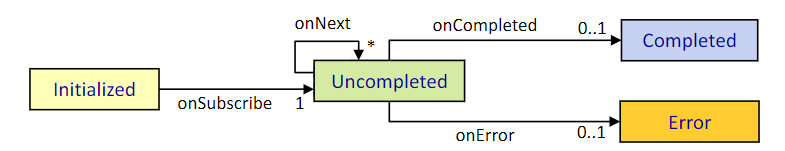
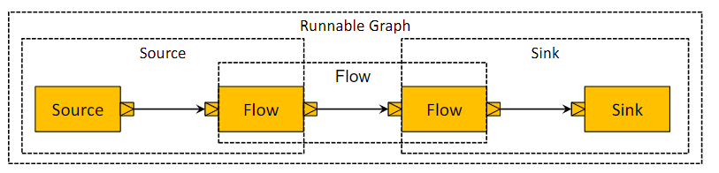
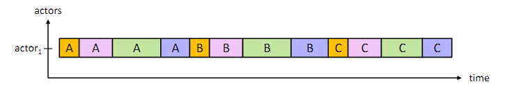
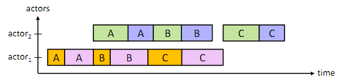

# Reactive Stream (Akka Streams) 

## Was sind reaktive Ströme?
- Streams: Datenströme, wobei Elemente kontinuierlich verarbeitet werden können bevor der Datenstrom endet
- Ziel:
    - Asynchronität
    - Backpressure: Empfänger bestimmt das Tempo der Verarbeitung

## Erkläre das Konzept von Stream Processing.
Stream Processing ist die Verarbeitung von laufenden Datenströmen – also Daten, die nicht auf einmal, sondern nach und nach über die Zeit eintreffen.
- Publisher schickt Daten raus
- Subscriber will Daten empfange, aber nur so viele wie er verarbeiten kann -> Backpressure
- Ablauf in 4 Kernmethoden:
    - `onSubscribe`: Publisher registriert Subscriber
    - `onNext`: wird jedes Mal aufgerufen, wenn ein neues Element verfügbar ist
    - `onError`: wird aufgerufen wenn ein Fehler im Stream auftritt -> danach keine Nachrichten mehr
    - `onComplete`: wird aufgerufen, wenn der Stream abgeschlossen ist -> fertig



## Was ist Backpressure und auf welche 5 Arten kann es umgesetzt werden?
- Problem: Publisher produziert Daten schneller als Subscriber sie konsumieren kann
- Lösung: Backpressure = Subscriber fragt wiederholt eine Anzahl an Elementen an, die er verarbeiten kann

Der Publisher kann Backpressure auf verschiedene Arten umsetzen:
- Forward: Leitet die Backpressure weiter zurück zur Quelle (zb. Datenbank)
- Keine Elemente generieren und warten bis der Subscriber bereit ist
- Buffer: Elemente werden in einem Puffer gespeichert, bis der Subscriber bereit ist, sie zu verarbeiten
- Drop: Elemente werden verworfen
- Stream abbrechen

## Was sind Akka Streams?
- = Implementierung des Reactive Streams-Standards in Akka
- Ermöglicht die Verarbeitung von Datenströmen in einem reaktiven und asynchronen Stil
- Sind implementiert mit Akka Actors

## Was ist der Unterschied zwischen Akka Streams und Akka Actors?
- Streams machen Backpressure automatisch
- Streams können nicht verteilt werden

## Welche Verarbeitungsschritte (Processing Stage) gibt es bei Akka Streams?
- Source: kein Input, ein Output
- Flow: ein Input, ein Output
- Sink: ein Input, kein Output

Die Verarbeitungsschritte können miteinander verbunden werden in neue Verarbeitungsschritte:



Kombinieren der Verarbeitungsschritte:
- Source via Flow -> Source; zb. `val source: Source[Double, NotUsed] = source.via(Flow[Int].map(_*2.0)))`
- Flow via Flow -> Flow
- Flow to Sink -> Sink
- Source to Sink -> Runnable Graph

## Was ist Materialization?
- = Prozess, bei dem die Verarbeitungsschritte (Source, Flow, Sink) in einen Stream umgewandelt werden, der dann ausgeführt werden kann -> mit allen Ressourcen, die benötigt werden
- wird mit der `run` Methode ausgeführt
```scala 
given ActorSystem = ActorSystem(Root(), "MyActorSystem")
val graph: RunnableGraph[NotUsed] = source.via(flow).to(sink)
graph.run() // ActorSystem is implicitly converted to a Materializer
```

## Was ist ein Runnable Graph?
= ein Graph ohne offenen Input oder Output, der direkt ausgeführt werden kann
```scala
val source = Source(1 to 10)
val flow = Flow[Int].map(_ * 2)
val sink = Sink.foreach[Int](i => print(s"$i "))
val graph: RunnableGraph[NotUsed] = source.via(flow).to(sink)
```

## Was ist Operator Fusion?
- Elemente werden von einem Verarbeitungsschritt zum nächsten weitergegeben
- Fusionierte Verarbeitungsschritte werden in einem einzigen Schritt ausgeführt



## Wie kann man die Streams parallel ausführen?
Mit `async` Methode:
- Die Verarbeitungsschritte werden verschiedenen Aktoren zugewiesen, die parallel arbeiten können
```scala
source.via(flow1).async.via(flow2).runWith(sink)
```


Mit `mapAsync` Methode:
- Man kann Level an Parallelität angeben
- mit `mapAsyncUnordered` wird die Reihenfolge der Elemente nicht beachtet, sonst schon
```scala
source
    .mapAsync(3)(param => Future { expensiveTask1(param) })
    .mapAsync(3)(param => Future { expensiveTask2(param) })
    .runWith(sink)
```	

## Welche Fehlerbehandlung gibt es in Akka Streams?
Wenn eine Exception auftritt, wird der Stream abgebrochen, das kann mit folgenden Fehlerbehandlungsstrategien vermieden werden:
- `recover`: gibt letzten gültigen Wert zurück und beendet den Stream
- `recoverWithRetries`: gibt neuen Stream zurück und beendet den alten
- `RestartSource.withBackoff`: wiederholt Neustarten des Streams
- Aktor Supervision

